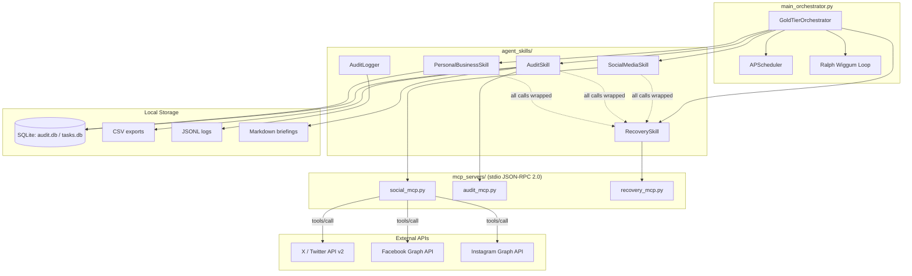
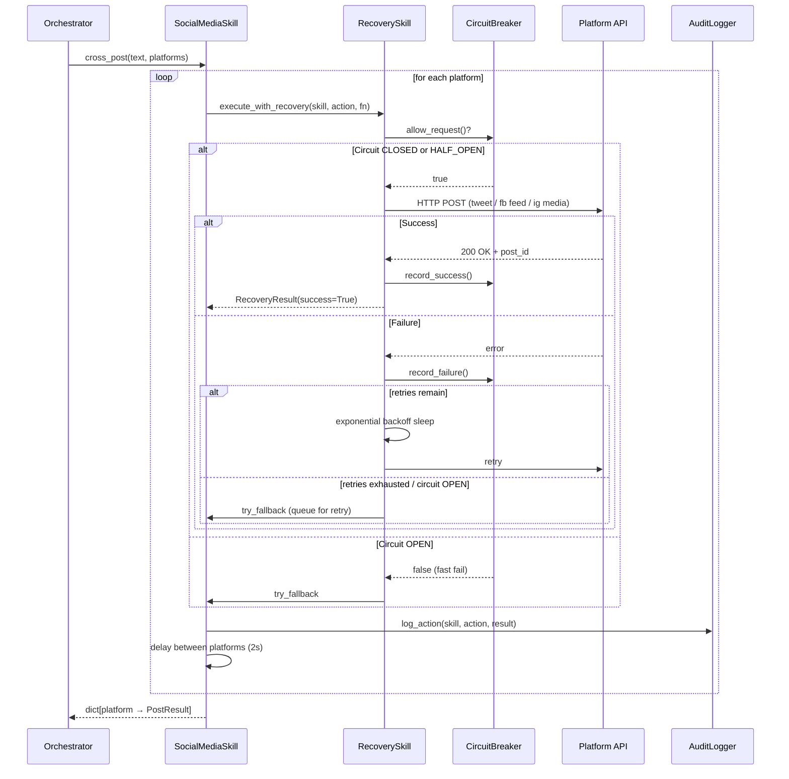
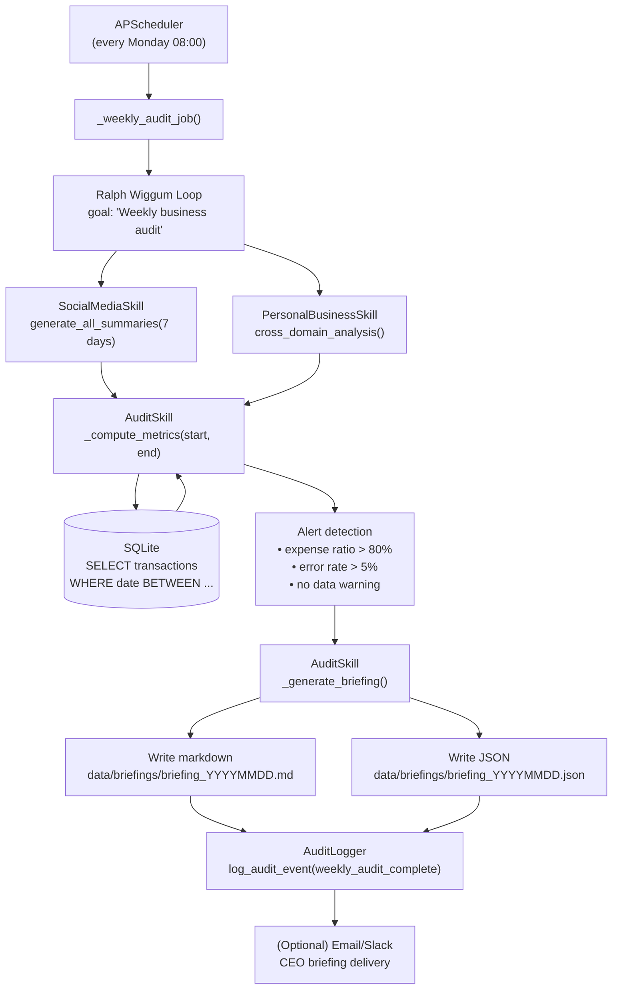
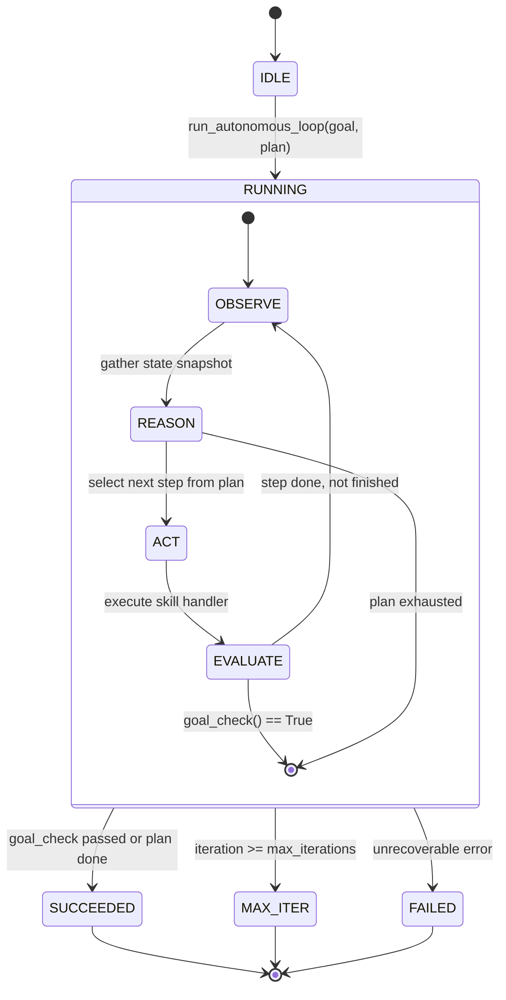
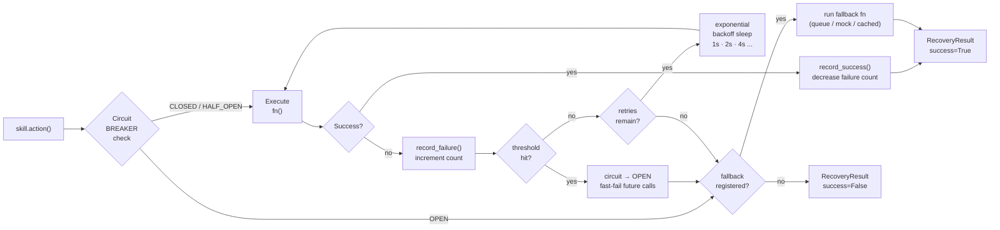

# Gold Tier Autonomous Employee — Architecture

> Version 1.0 · 2026-05-01

---

## Table of Contents

1. [System Overview](#1-system-overview)
2. [Component Map](#2-component-map)
3. [Orchestrator → Skills → MCP Servers](#3-orchestrator--skills--mcp-servers)
4. [Social Posting Flow](#4-social-posting-flow)
5. [Weekly Audit Flow](#5-weekly-audit-flow)
6. [Ralph Wiggum Loop](#6-ralph-wiggum-loop)
7. [Error Recovery Strategy](#7-error-recovery-strategy)
8. [Data Flows & Storage](#8-data-flows--storage)
9. [Security & Credentials](#9-security--credentials)
10. [Lessons Learned](#10-lessons-learned)

---

## 1. System Overview

The Gold Tier Autonomous Employee is a fully autonomous AI agent system that handles:

- **Social Media**: automated posting and engagement analytics across Facebook, Instagram, and X (Twitter)
- **Business Auditing**: weekly accounting review using local SQLite/CSV (no Odoo dependency)
- **CEO Briefings**: auto-generated markdown + JSON reports delivered on a schedule
- **Task Management**: cross-domain personal + business task tracking with priority scoring
- **Self-Healing**: circuit breakers, exponential back-off, and registered fallbacks

The system is built around three principles:

| Principle | Implementation |
|---|---|
| **Modularity** | Every capability is a standalone `AgentSkill` with a clean async API |
| **Resilience** | All external calls go through `RecoverySkill` (retry + circuit breaker + fallback) |
| **Observability** | Every action, decision, and error is recorded as structured JSON |

---

## 2. Component Map

```
┌─────────────────────────────────────────────────────────────────────┐
│                     Gold Tier Autonomous Employee                    │
│                                                                     │
│  ┌─────────────────────────────────────────────────────────────┐   │
│  │               main_orchestrator.py                          │   │
│  │  GoldTierOrchestrator · APScheduler · Ralph Wiggum Loop     │   │
│  └──────────┬──────────────────────────────────────────────────┘   │
│             │ uses                                                  │
│   ┌─────────▼──────────────────────────────────────────────┐       │
│   │                  agent_skills/                          │       │
│   │  ┌──────────┐ ┌────────┐ ┌──────────┐ ┌────────────┐  │       │
│   │  │ social   │ │ audit  │ │ recovery │ │ personal_  │  │       │
│   │  │ .py      │ │ .py    │ │ .py      │ │ business   │  │       │
│   │  └──────────┘ └────────┘ └──────────┘ └────────────┘  │       │
│   │  ┌─────────────────────────────────────────────────┐   │       │
│   │  │              audit_logger.py                    │   │       │
│   │  └─────────────────────────────────────────────────┘   │       │
│   └────────────────────────────┬───────────────────────────┘       │
│                                │ exposed via                        │
│   ┌────────────────────────────▼───────────────────────────┐       │
│   │                   mcp_servers/                          │       │
│   │   ┌──────────────┐ ┌──────────────┐ ┌───────────────┐  │       │
│   │   │ social_mcp   │ │ audit_mcp    │ │ recovery_mcp  │  │       │
│   │   │ (stdio)      │ │ (stdio)      │ │ (stdio)       │  │       │
│   │   └──────────────┘ └──────────────┘ └───────────────┘  │       │
│   └────────────────────────────────────────────────────────┘       │
│                                                                     │
│   ┌────────────┐  ┌──────────────┐  ┌────────────┐  ┌──────────┐  │
│   │ config/    │  │ logs/        │  │ data/      │  │ docs/    │  │
│   │ .env       │  │ *.jsonl      │  │ *.db *.csv │  │ ARCH...  │  │
│   └────────────┘  └──────────────┘  └────────────┘  └──────────┘  │
└─────────────────────────────────────────────────────────────────────┘
```

---

## 3. Orchestrator → Skills → MCP Servers



---

## 4. Social Posting Flow



---

## 5. Weekly Audit Flow



---

## 6. Ralph Wiggum Loop

The autonomous multi-step loop is named after Homer Simpson's observation:
> *"I'm Ralph Wiggum — I'm not sure what I'm doing but I keep doing it anyway."*

The loop keeps iterating (observe → reason → act) until the goal is achieved or a maximum iteration cap is hit.



### Loop phases in detail

| Phase | What happens |
|---|---|
| **OBSERVE** | Snapshot: open circuits, pending critical tasks, last error |
| **REASON** | Select the next unexecuted step from the plan; return `None` if done |
| **ACT** | Dispatch to skill handler; record duration and result |
| **EVALUATE** | Check goal condition; if step failed, log and continue (recovery already tried) |
| **LOOP** | Sleep `loop_sleep_seconds`; increment iteration counter |

### Built-in safeguards

- **Max iterations** (`app.max_iterations = 25`) — hard ceiling, no infinite loops
- **Per-step recovery** — every `_act()` call goes through `RecoverySkill`
- **Checkpoint logging** — every step result written to `logs/actions.jsonl`
- **Goal check callback** — caller can supply custom completion predicate

---

## 7. Error Recovery Strategy



### Circuit breaker states

```
  CLOSED ──[failures >= threshold]──► OPEN
     ▲                                  │
     │                                  │ recovery_timeout elapsed
     │                                  ▼
     └──[2 probes succeed]──── HALF_OPEN
```

| State | Behaviour |
|---|---|
| **CLOSED** | All requests pass through normally |
| **OPEN** | All requests fast-fail → fallback immediately |
| **HALF_OPEN** | 1 probe request; success → CLOSED, failure → OPEN |

### Fallback hierarchy

1. **Registered fallback** (e.g., queue post for later)
2. **Cached/mock response** (e.g., return last known social summary)
3. **Graceful degradation** (log + continue loop without that capability)
4. **Alert** (log CRITICAL + surface in next CEO briefing under Risks)

---

## 8. Data Flows & Storage

```
data/
├── audit.db          — SQLite: financial transactions (double-entry rows)
├── tasks.db          — SQLite: personal + business tasks
├── exports/          — CSV snapshots exported on demand
│   └── transactions_YYYY-MM-DD_YYYY-MM-DD.csv
└── briefings/        — CEO briefings
    ├── briefing_YYYYMMDD.md   (Jinja2 rendered markdown)
    └── briefing_YYYYMMDD.json (machine-readable)

logs/
├── actions.jsonl     — every skill action (rotating, 10 MB)
├── errors.jsonl      — every error with severity + recoverable flag
└── audit.jsonl       — decisions, state changes, audit events
```

---

## 9. Security & Credentials

| Rule | Implementation |
|---|---|
| No secrets in code | All credentials loaded from `.env` via `pydantic-settings` |
| `SecretStr` wrapper | `get_secret_value()` required to unwrap; prevents accidental logging |
| `.env` not committed | `.gitignore` includes `.env` |
| Cached credential objects | `@lru_cache(maxsize=1)` — credentials loaded once per process |
| Token rotation | Swap `.env` values and restart; no code changes needed |

---

## 10. Lessons Learned

### What worked well

1. **RecoverySkill as a shared infrastructure layer** — wrapping every external call through one place made it trivial to add circuit breakers post-hoc without touching skill code.

2. **Async-first design** — using `asyncio.gather` for cross-platform posting and summary generation cut wall-clock time significantly vs. sequential calls.

3. **SQLite over Odoo for accounting** — removing the Odoo dependency eliminated a whole class of network failure modes during hackathon testing. The local DB is fast, zero-config, and trivially exportable to CSV.

4. **Jinja2 for CEO briefings** — separating the template from the data made it easy to iterate the report format without touching business logic.

5. **Structured JSON logging (JSONL)** — `jq`-queryable logs made post-run debugging dramatically faster than grepping plain text.

### Tradeoffs & known limitations

| Area | Tradeoff |
|---|---|
| Social APIs | Instagram Graph API requires a Business account + Facebook Page linkage; `instagrapi` is a fallback but violates ToS for production |
| MCP transport | Stdio transport is simple but limits parallelism; upgrade to SSE/HTTP for multi-client scenarios |
| Accounting | Local SQLite works for single-operator use; multi-user or multi-entity accounting needs a proper ledger (e.g., hledger, Actual Budget) |
| Loop reasoning | `_reason()` currently just executes a static plan list; upgrading to LLM-based planning (Claude tool-use loop) would enable truly dynamic step selection |
| Scheduling | APScheduler in-process is fine for a single node; distributed scheduling (Celery Beat, Modal cron) needed for HA deployments |

### Recommended next steps

1. **Wire in Claude API** for dynamic plan generation inside `_reason()` — turn the static plan list into a live reasoning loop.
2. **Add SSE transport** to MCP servers so they can be registered in Claude Code desktop and used interactively.
3. **Email/Slack delivery** for CEO briefings — `NotificationCreds` is already wired; just needs a `send_briefing()` method.
4. **Add `hledger` or `beancount` adapter** as a drop-in replacement for the SQLite accounting layer.
